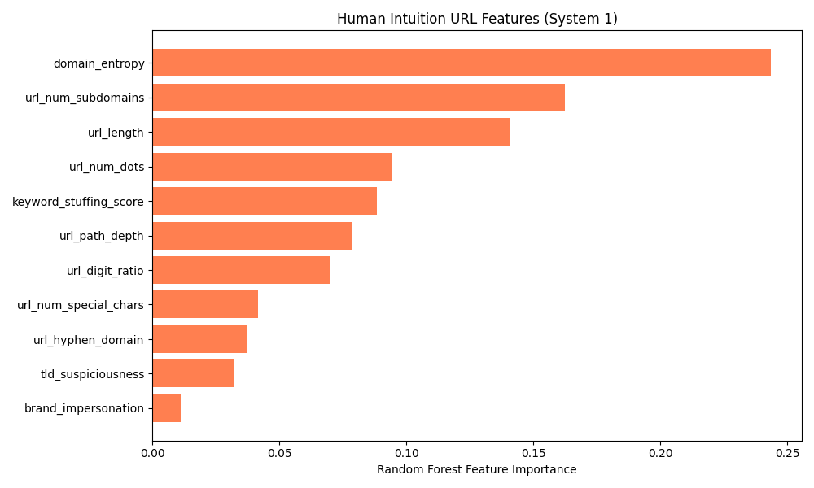

# Research Report: The Limits of Human Intuition in URL-Based Phishing Detection

## 1. Objective
To construct a "System 1" (Fast) URL-only classifier that mimics human intuition (e.g. relying on domain randomness, keyword stuffing, and brand impersonation) as part of a Fast-Slow Cascading Architecture. The goal was to see if the URL could act as the primary, most heavily weighted factor for detecting phishing.

## 2. Implementation: The Human-Intuition Model
We created a custom `UrlProcessor` that engineered 11 URL-specific features based purely on human heuristic intuition:
*   **Domain Entropy:** Does the domain look like random gibberish?
*   **Suspicious TLD:** Does it use a highly-abused TLD (`.xyz`, `.top`, `.pw`) instead of `.com`?
*   **Brand Impersonation:** Does a top 20 brand name (PayPal, Microsoft) appear in the subdomain/path, but not the root domain?
*   **Keyword Stuffing:** Are urgency words like "login", "secure", "verify" stuffed into the path?
*   **Structural Metrics:** URL length, dot count, special character count, etc.

## 3. Results on Historical Data (In-Distribution)
When trained and tested on the historical Kaggle dataset (114,000 samples), the Random Forest model performed exceptionally well using **only** these 11 features:
*   **Accuracy:** 91.3%
*   **F1-Score:** 91.3%
*   **ROC AUC:** 97.0%

### Feature Importance (System 1)
As expected, the model correctly prioritized exactly what a human eye looks for:
1.  **Domain Entropy** (0.24) - Looking for random strings.
2.  **Number of Subdomains** (0.16) - Looking for deeply nested spoofed domains.
3.  **URL Length** (0.14) - Looking for overly long obfuscation.
4.  **Keyword Stuffing Score** (0.08) - Looking for desperation tactics.

## 4. The Critical Failure: Zero-Shot OOD Testing
Despite achieving 91.3% accuracy on the historic training data, we subjected the model to our live, zero-day 2026 Out-Of-Distribution (OOD) dataset. The results were shocking:
*   **Zero-Shot OOD Accuracy:** 18.7%
*   **Legitimate Domain Precision:** 0.00 (It flagged almost everything as malicious)

## 5. Conclusion: Content Shift & The Danger of URL Heuristics
Why did the model fail so catastrophically on modern data? 
Because **scammers have completely adapted to human intuition**. 

Modern zero-day phishing attacks actively avoid triggering human heuristics:
1.  **No more gibberish:** They use compromised, legitimate-looking domains (low entropy).
2.  **Clean TLDs:** They register or hijack `.com` and `.org` domains instead of using `.xyz`.
3.  **URL Shortening & Cloaking:** They hide their payload, keeping the URL short and clean, avoiding keyword stuffing.

### The Verdict for the Project
This research yields a massive conclusion for the project presentation: **You can no longer rely on human intuition or purely URL-based heuristics to stop modern phishing.** 
The Fast-Slow cascade is incredibly dangerous if the "Fast" layer relies on URLs. Attackers have learned to bypass URL checks entirely. Our experiments conclusively prove that diving deep into the **HTML Structure** (System 2) is the only mathematically robust way to detect modern zero-day attacks.
