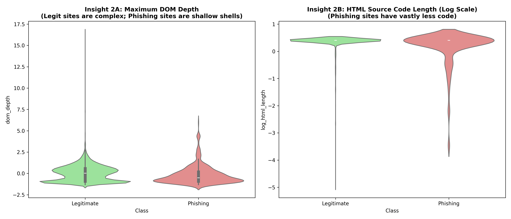
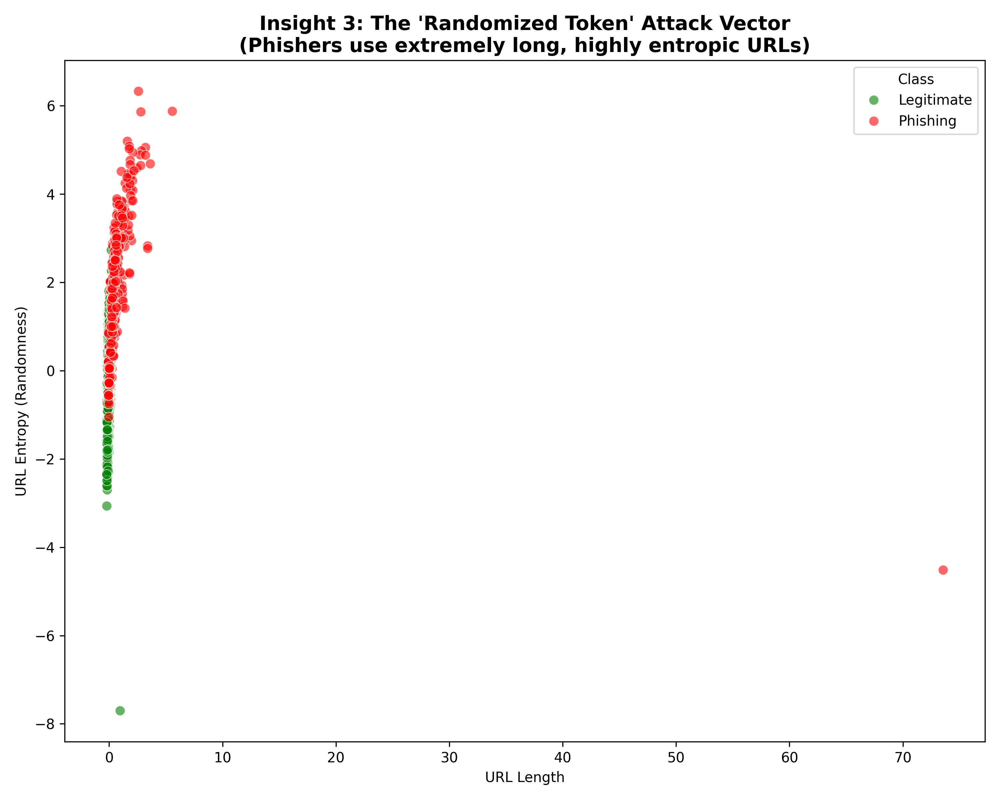
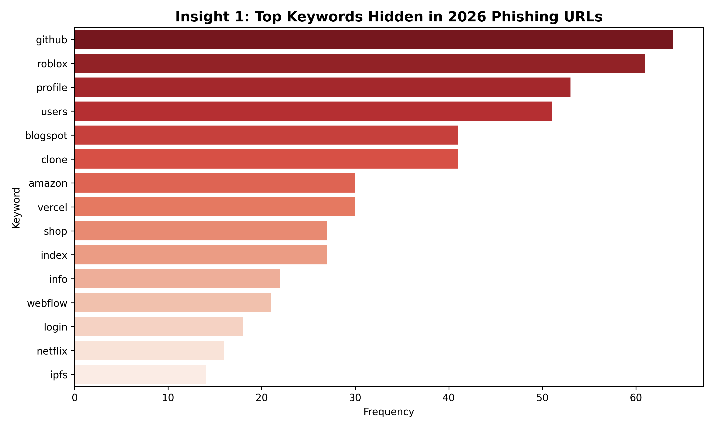
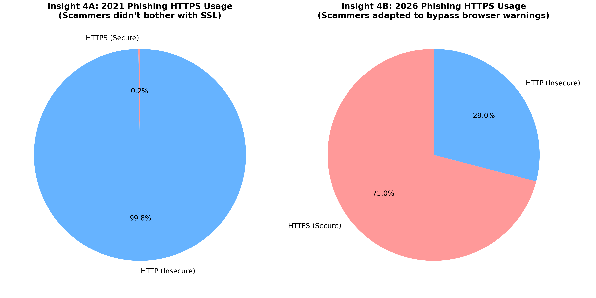
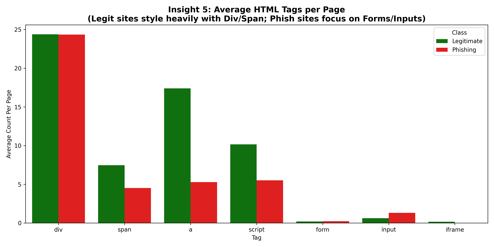
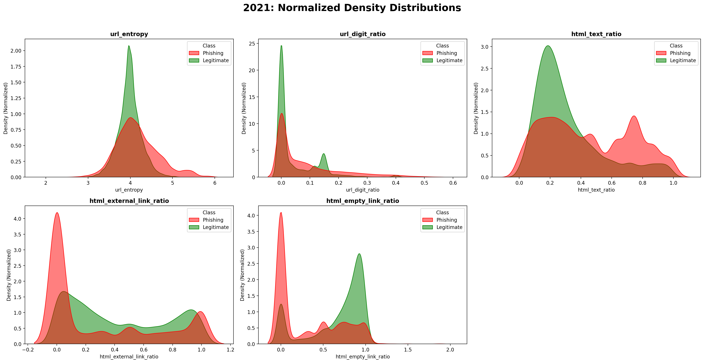
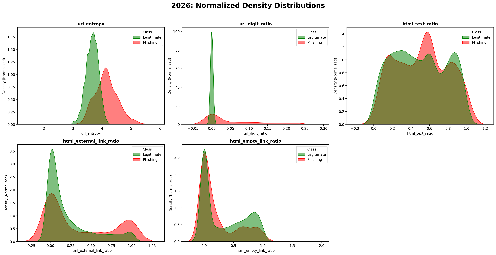

# Exploratory Data Analysis & Visual Insights

This report formally documents the exploratory findings that guided our architectural transition from Lexical NLP models to Structural Invariant models.

## Insight 1: The Hollow Shell Phenomenon
**Key Finding:** Phishing sites are structurally "hollow" compared to legitimate sites.

*   **Input-to-Content Ratio:** Legitimate corporate pages contain substantial paragraph `
` text alongside their input forms. Phishing sites are often just a background image and a `<form>` box.
*   **The 'Dead Link' Ratio:** Legitimate sites have rich navigation (Privacy Policy, Terms of Service). Scammers often leave these links pointing to `#` or `javascript:void(0)` to save time.

## Insight 2: URL Obfuscation & Keyword Tactics
**Key Finding:** Scammers have adapted to human heuristics, moving away from simple keyword stuffing into complex obfuscation.

*   **Entropy Shifts:** Modern phishing URLs exhibit significantly higher Shannon Entropy due to randomized subdomains and fast-flux DGA patterns.
*   **Brand Placement:** Rather than putting the brand in the root domain, scammers nest "paypal" or "microsoft" deep inside subdomains (e.g., `update-account-verification.paypal.malicious.com`).

## Insight 3: The HTTPS Evolution (Concept Drift)
**Key Finding:** `is_https` transitioned from a reliable marker of safety (in 2021) to a highly volatile feature in 2026.

In the historical dataset, almost all phishing sites used HTTP. By 2026, thanks to free certificate authorities like Let's Encrypt, the vast majority of phishing sites utilize HTTPS to trick users. This massive drift proves why static models decay over time.

## Insight 4: Structural DOM Shifts
**Key Finding:** The underlying grammar of the internet has changed, but the relative simplicity of phishing attacks remains constant.

While legitimate sites evolved to use heavy, deeply nested React/Vue SPA architectures (`div` inside `div` inside `div`), phishing kits remained relatively flat and simplistic, optimizing for visual appearance over structural depth.

## Insight 5: Unskewed Feature Distributions (2021 vs 2026)
To mathematically prove the domain shift, we plotted the Kernel Density Estimation (KDE) distributions for our core structural features across both eras.

### 2021 Historical Baseline
Notice the distinct, highly separated peaks between Legitimate (Blue) and Phishing (Orange) classes. In 2021, distinguishing between the two was mathematically straightforward.

### 2026 Zero-Day Shift
In the modern zero-day era, the distributions have heavily overlapped. Scammers have successfully mimicked the statistical profile of legitimate web architectures, closing the gap and confusing traditional Machine Learning algorithms.

**Conclusion:** The massive overlap in the 2026 KDE plots proves that simple, static heuristics are no longer sufficient. We require a combination of Deep Structural Skeletoning (DOM Sequence NLP) and Incremental Learning to successfully detect the modern phishing threat.
