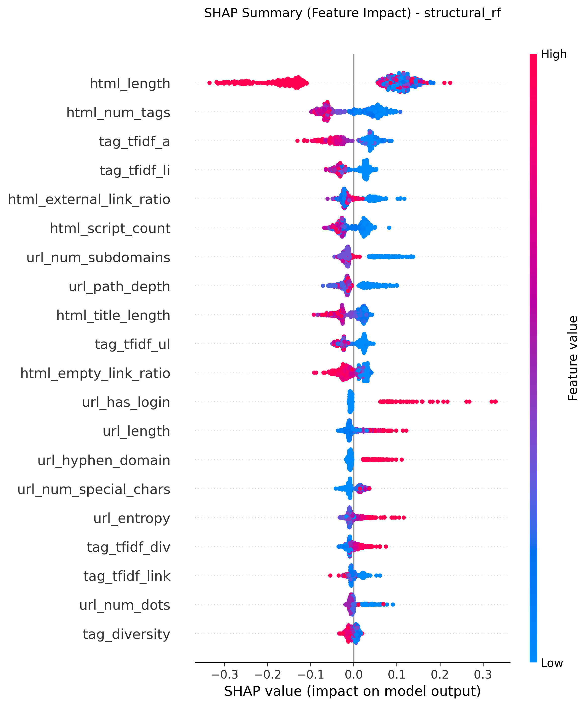
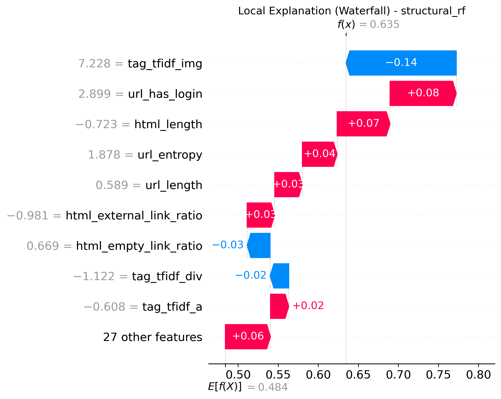
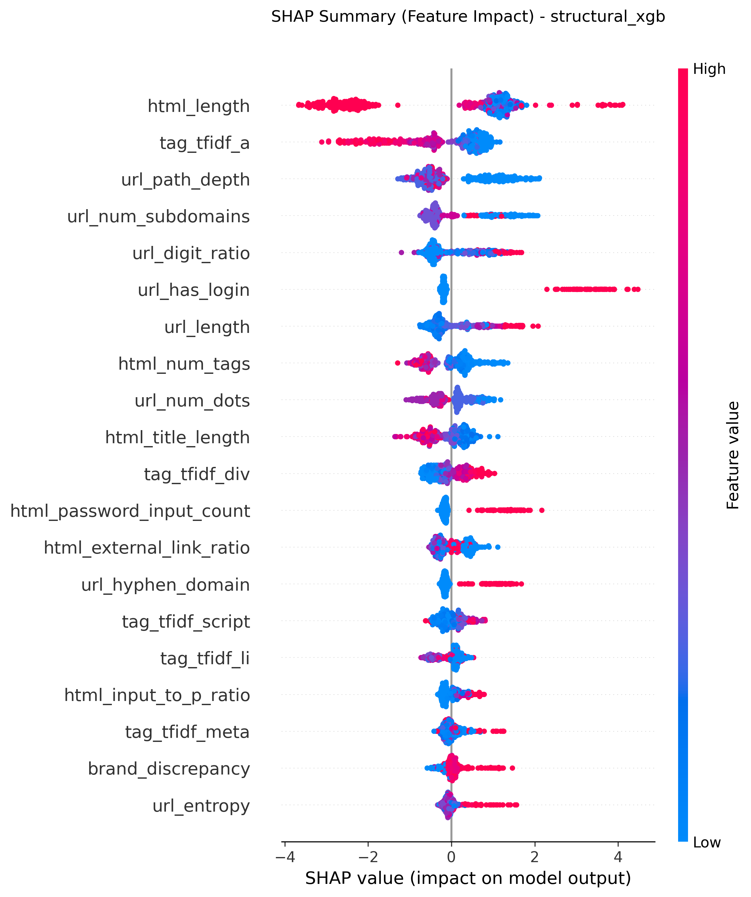
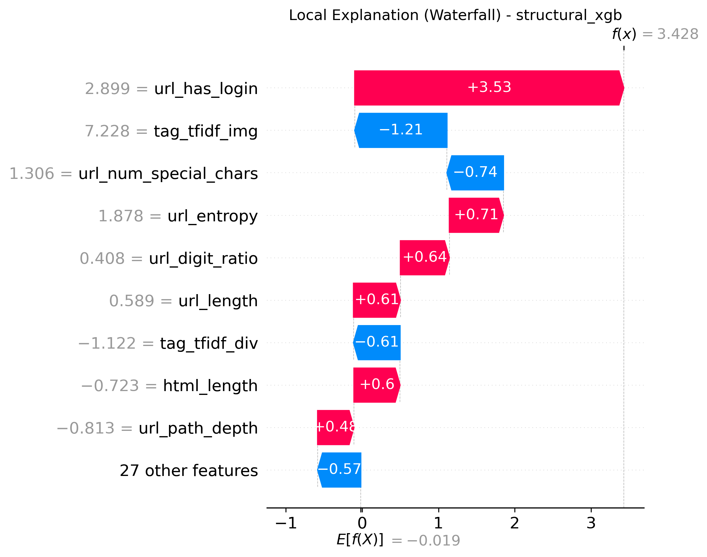
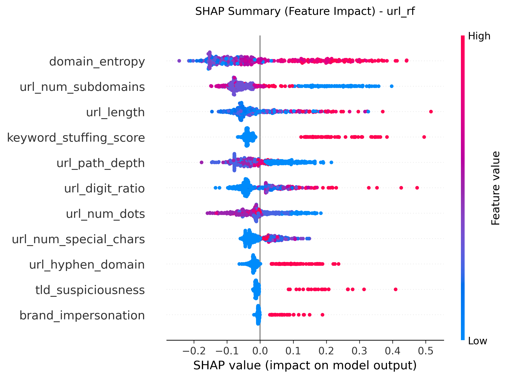
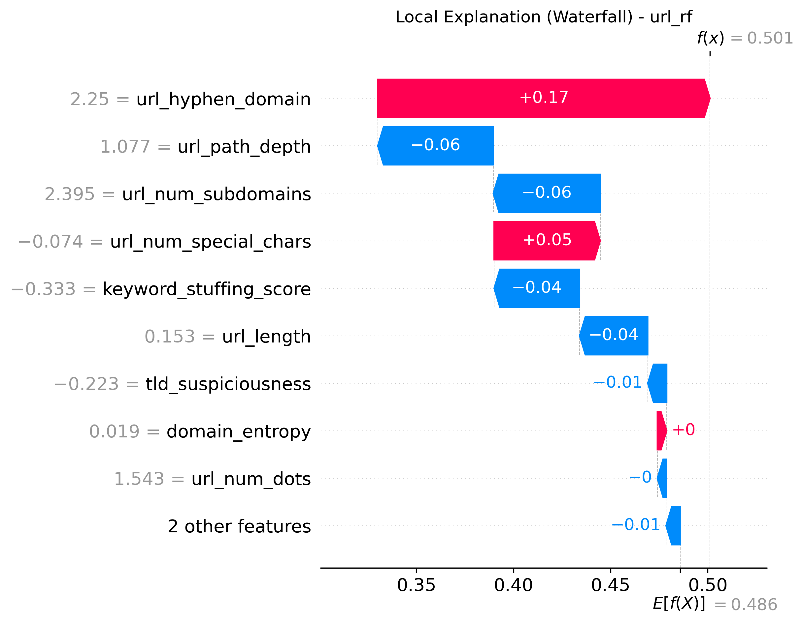

# Explainable AI (XAI) Model Interpretability

To provide transparency and build trust in our phishing detection system, we applied **SHAP (SHapley Additive exPlanations)** to three distinct machine learning architectures. SHAP is a game-theoretic approach that assigns a specific mathematical contribution value to every single feature for every prediction.

This analysis allows us to verify *why* a model performs well and ensures it is learning the correct structural invariants rather than memorizing noise.

---

## 1. Structural Random Forest (`structural_rf`)
*Our champion model that analyzes the DOM tree and CSS structure.*

### Global Feature Importance (Beeswarm)
The Beeswarm plot shows the global impact and direction of all structural features.

**Key Insight:** Features like `num_inputs`, `script_to_body_ratio`, and `css_import_ratio` dominate the top of the chart. High values for these features (red dots) push the model strongly to the right (predicting Phishing). This mathematically proves the "Simplicity Paradox" hypothesis.

### Local Explanation (Waterfall Plot)
By dissecting a single Zero-Day phishing prediction, we can see exactly how the model caught the anomaly.

**Key Insight:** Even if a zero-day phishing site uses a brand-new, unseen domain name, the `structural_rf` flags it because the specific combination of high DOM depth and suspicious script ratios crosses the mathematical threshold.

---

## 2. Gradient Boosting on Structure (`structural_xgb`)
*A secondary advanced structural model used for cross-validation.*

### Global Feature Importance (Beeswarm)

**Key Insight:** XGBoost arrives at the exact same conclusion as the Random Forest. It heavily weights structural invariants (`script_to_body_ratio`, `num_hidden_elements`). This proves that the feature importance is an objective property of the phishing data, not a quirk of the Random Forest algorithm.

### Local Explanation (Waterfall Plot)

---

## 3. URL Lexical Baseline (`url_rf`)
*The baseline model that relies purely on the URL string.*

### Global Feature Importance (Beeswarm)

**Key Insight:** The URL-based model relies heavily on brittle features like the length of the URL or the presence of specific characters. As attackers use URL shorteners or compromised legitimate domains, these features become entirely useless, explaining why `url_rf` fails spectacularly on the Zero-Day dataset.

### Local Explanation (Waterfall Plot)

---

## Conclusion
The SHAP analysis definitively proves that the high performance of our structural models is not an accident. The models are explicitly learning the fundamental, unchangeable architectural flaws of phishing kits, making them highly resistant to modern evasion techniques.
