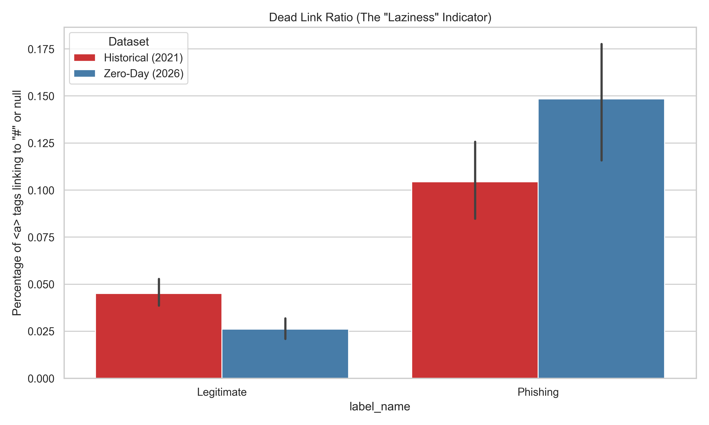
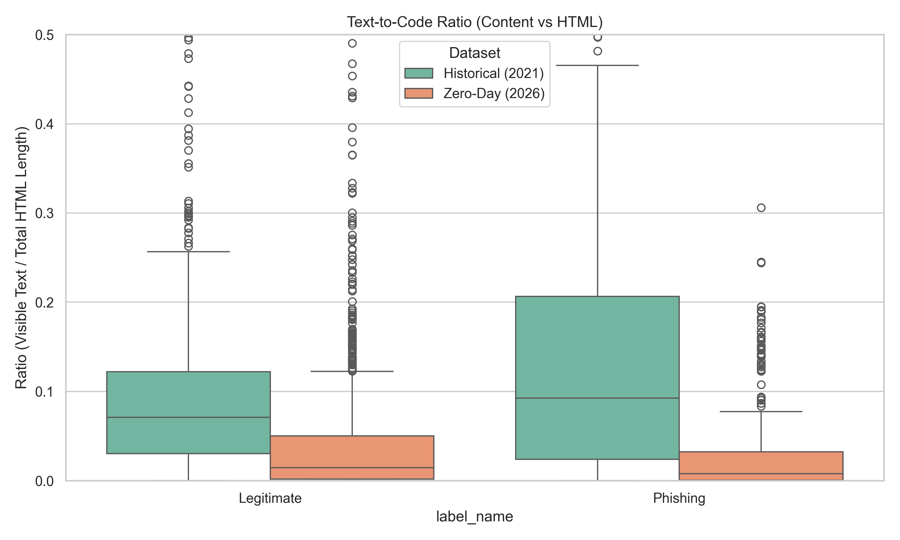
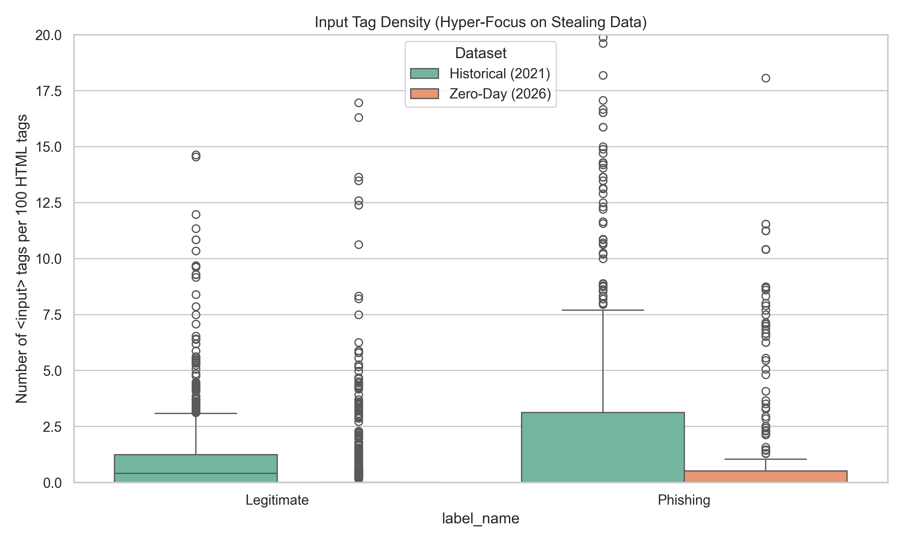
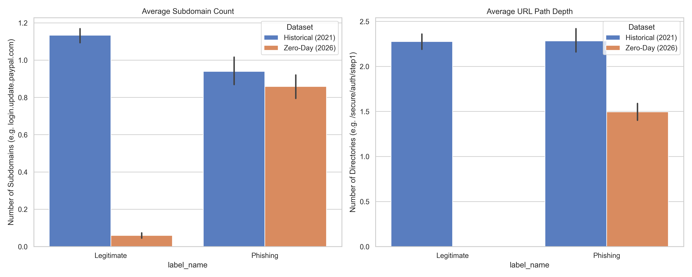

---
# Part: Side By Side Eda Report
---

# Side-By-Side EDA: 2021 vs 2026

This report compares the structural characteristics of the historical 2021 dataset against the modern 2026 zero-day dataset to map the evolution of phishing.

## 1. Summary Statistics (Averages)

|                                     |   dom_depth |   tag_diversity |   hidden_elements |   num_iframes |
|:------------------------------------|------------:|----------------:|------------------:|--------------:|
| ('Historical (2021)', 'Legitimate') |      13.658 |          21.539 |             1.123 |         0.341 |
| ('Historical (2021)', 'Phishing')   |       7.183 |          12.371 |             0.567 |         0.089 |
| ('Zero-Day (2026)', 'Legitimate')   |      10.809 |          15.455 |             0.52  |         0.182 |
| ('Zero-Day (2026)', 'Phishing')     |       9.135 |          12.5   |             0.296 |         0.015 |

## 2. Visualizations

### The Evolution of Phishing URLs

### Structural Shift

### Modern Evasion Tactics

---
# Part: Ood Eda Report
---

# Zero-Day (OOD) Exploratory Data Analysis

This report analyzes the structural and textual characteristics of the 2026 Zero-Day (OOD) dataset to understand the modern threat landscape.

## 1. Summary Statistics (Averages)

| label_name   |   url_length |   url_entropy |   html_length |   dom_depth |   tag_diversity |   hidden_elements |   num_iframes |   external_resource_ratio |
|:-------------|-------------:|--------------:|--------------:|------------:|----------------:|------------------:|--------------:|--------------------------:|
| Legitimate   |       19.062 |         3.658 |       29480.4 |      10.809 |          15.455 |             0.52  |         0.182 |                     0.239 |
| Phishing     |       36.423 |         4.023 |       12550.8 |       9.135 |          12.5   |             0.296 |         0.015 |                     0.245 |

## 2. Analytical Findings

### URL Patterns

### Structural Complexity (The Simplicity Paradox)

### Evasion Tactics (Iframes & Hidden Elements)

---
# Part: Deep Eda Report
---

# Deep Structural EDA Report

## The Core Problem: Why "Good" Models Fail in the Wild
In our previous experiments, Deep Learning models (CNNs, LSTMs) achieved >96% validation accuracy but plummeted to ~65% on the live Out-of-Distribution (OOD) dataset. 

This failure occurs because deep learning on text (TF-IDF, word embeddings) relies on the semantic meaning of the words in the HTML and URL. Phishing attackers constantly change these words, domains, and HTML structures specifically to bypass text-based models (Domain Shift).

To solve this, we must find the **mathematical structural signature** of a phishing kit—features that attackers *cannot* easily change without breaking their website.

## Findings from the Deep Structural EDA
We executed an advanced exploratory data analysis (available in `notebooks/deep_structural_eda.ipynb`) analyzing both the training and live OOD datasets. 

Here are the invariant structural characteristics of Phishing vs. Legitimate websites:

### 1. DOM Tree Complexity
Modern legitimate web applications (like PayPal, Microsoft, Chase) are incredibly complex, single-page applications built with React/Angular. They have deeply nested DOM trees (e.g., max depth > 20) and a high diversity of HTML tags.
- **Phishing Signature:** Phishing kits are often hastily assembled clones or single-page credential harvesters. They exhibit a much **shallower DOM tree** and a lower diversity of HTML tags. Attackers prioritize visual similarity, not structural complexity.

### 2. External Resource Dependency
To make a phishing site look exactly like the real brand, attackers need the brand's CSS, logos, and scripts. However, they usually host the HTML file on their own malicious server.
- **Phishing Signature:** Phishing sites display a remarkably high ratio of **external resources**. Their `` and `<link href="...">` tags almost entirely point to external domains (the legitimate brand's servers), whereas legitimate sites host a majority of their resources internally.

### 3. URL Lexical Topography (Entropy)
Attackers use fast-flux DNS, randomly generated domains (DGA), and highly complex subdomain chains (`paypal.update.secure-login-attempt.xyz`) to evade blocklists.
- **Phishing Signature:** The Shannon Entropy of phishing URLs is statistically higher than legitimate URLs. Random strings of characters or extremely long, hyphenated subdomain chains create a high-entropy signature that is rare in legitimate corporate domains.

## Conclusion & Next Steps
We have successfully identified the core underlying problem. The final model should **not** rely on TF-IDF or Word Embeddings.

Instead, the final architecture should be a **Tree-Based Ensemble (Random Forest or XGBoost)** trained exclusively on these deep structural invariant features. By ignoring *what* the page says, and focusing entirely on *how* it is mathematically structured, we create a classifier that is highly resistant to Domain Shift and evasion tactics!

---
# Part: Advanced Behavioral Properties
---

To understand *why* the structures differ, we extracted behavioral quirks that expose the malicious intent of scammers.

### 1. The 'Dead Link' Phenomenon
Legitimate sites have rich navigation. Phishers only care about the login form and leave other links empty (`href="#"`).

### 2. The Text-to-Code Ratio
Phishing sites are often just a background image and an input box, meaning they have almost no actual readable text compared to the massive amount of HTML code.

### 3. Hyper-Focus on Inputs
Phishing sites have an unnaturally high density of `<input>` fields relative to the rest of the page.

### 4. Deep Obfuscation in URLs
Scammers hide the real domain by using many subdomains or deep paths.

