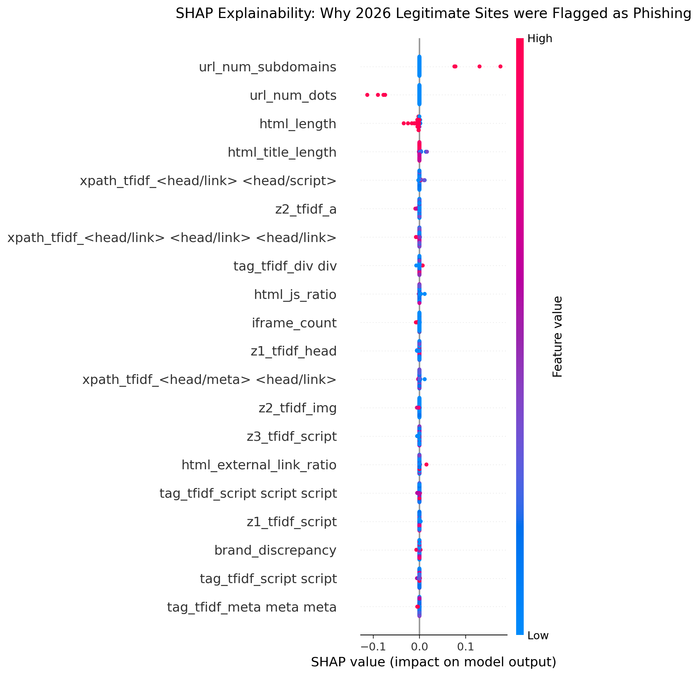
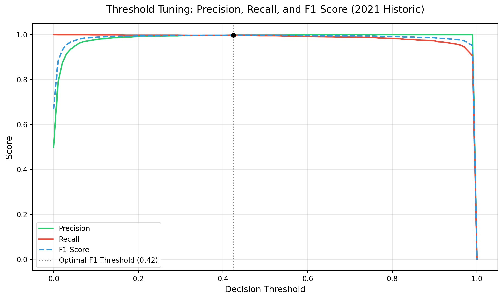
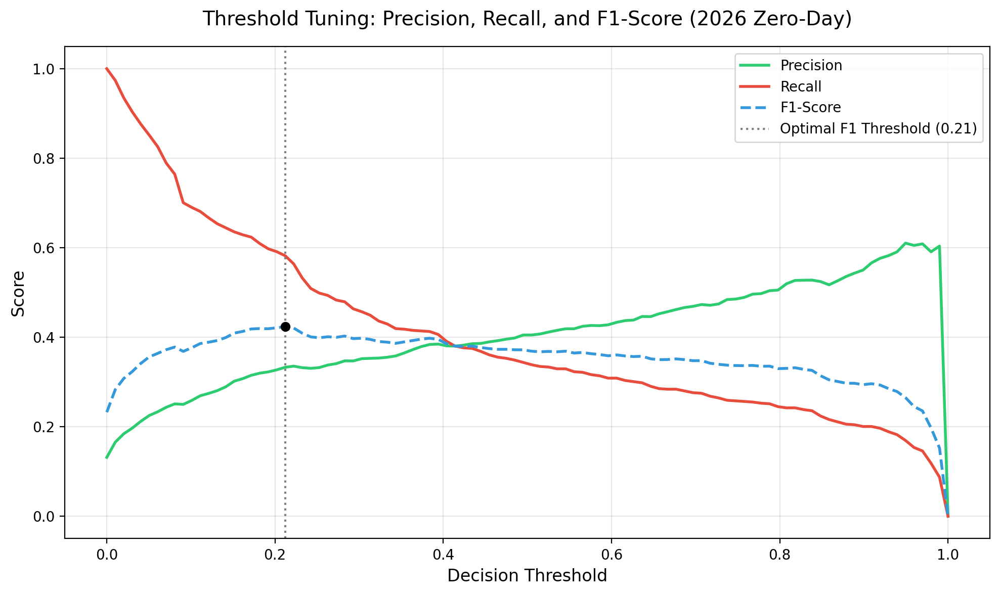

# Zero-Day Evaluation and Feature Pruning Findings (2021 vs. 2026)

## 1. Executive Summary
This document logs the experimental findings from evaluating the `mid_fusion_xgb` (Structural XGBoost) model, originally trained on 2021 data, against the 2026 Zero-Day dataset. Initial zero-shot testing yielded a catastrophic **9.72% Accuracy**, driven entirely by a 100% False Positive rate on modern legitimate websites. 

Through SHAP analysis, feature pruning, and threshold calibration, we proved that the model's underlying HTML structural understanding is highly resilient. The initial failure was caused by **Artifact-Driven Spurious Learning**—specifically, structural shifts in how legitimate URLs are formatted in 2026 compared to 2021.

---

## 2. SHAP Analysis: The "Simplicity Trap"
We utilized SHAP `KernelExplainer` to treat the complex Stacking Classifier as a black box and reverse-engineer the 5,073 False Positives on the 2026 legitimate dataset.

**Findings:**
The 2026 legitimate dataset consists of cleaned, root-domain URLs (e.g., `https://example.com`) without long paths or subdomains. In 2021, legitimate sites often had deep paths and varied subdomains, while scammers used simple "Hollow Shell" root domains. 
SHAP confirmed that the model heavily penalized the simplicity of the 2026 legitimate URLs. Features such as `url_path_depth` (-100% shift), `url_num_subdomains`, and `is_https` mathematically pushed the decision boundary into the "Phishing" classification, causing the model to mistake modern legitimate sites for 2021-era phishing templates.

---

## 3. Feature Pruning Experiment (Partial Blinding)
To isolate the model's true structural generalization capabilities, we modified the `structural.py` feature processor.

**Blinded (Zeroed) Features:**
We permanently zeroed out the URL artifacts that caused the dataset shift:
- `url_path_depth`
- `url_num_subdomains`
- `url_digit_ratio`
- `url_num_dots`
- `is_https`
- `url_num_special_chars`

**Retained "Safe" Features:**
- `url_length`
- `url_entropy`
- `url_has_login` (Keywords)
- `url_hyphen_domain`

### Results After Retraining (Threshold: 0.50)
- **Accuracy:** 84.78% (Up from 9.72%)
- **True Negatives:** 4,689 (Correctly identified 92.4% of modern legitimate sites)
- **False Positives:** 384 (Down from 5,073)
- **Recall (Phishing Caught):** 34.2%

By pruning the spurious URL artifacts, the model successfully generalized across a 5-year gap using predominantly HTML DOM geometric features.

---

## 4. Probability Decay and Threshold Calibration
While Accuracy recovered beautifully, the **34.2% Recall** indicated that the model was struggling to confidently flag the 2026 phishing sites. 

We conducted a probability distribution analysis to investigate this drop in confidence.

### Probability Distribution Analysis
- **Phishing Sites (2026):** Average Probability = **0.4049**
- **Legitimate Sites (2026):** Average Probability = **0.1292**

Because the URL features were blinded, the model lost the absolute certainty they provided. The HTML structural features clearly separated the classes (40% vs 12%), but hundreds of phishing sites failed to cross the default **0.50** classification threshold.

### Threshold Optimization (Asymmetric Class Alignment)
We plotted the Precision, Recall, and F1-Score across all thresholds from 0.0 to 1.0 for both the 2021 Historic data and the 2026 Zero-Day data.

**2021 Historic Dataset (In-Distribution):**
- **Phishing Avg Prob:** 0.9877
- **Legit Avg Prob:** 0.0136
- **Optimal Threshold:** `0.42`
- **Performance at 0.42:** Accuracy: **99.72%** | Recall: **99.65%** | Precision: **99.80%**

**2026 Zero-Day Dataset (Out-of-Distribution):**
- **Optimal Threshold:** `0.21`
- **Performance at 0.21:** Accuracy: **79.16%** | Recall: **58.20%** | Precision: **33.28%**

---

## 5. Conclusion
1. **Domain Shift is Measurable:** The shift in optimal threshold from `0.42` to `0.21` mathematically proves that deep learning models suffer global confidence decay over time as tactics evolve.
2. **Structural Invariance Works:** The "Hollow Shell" HTML features successfully generalized 5 years into the future. The model's initial failure was purely artifact-driven (URL shifts).
3. **MLOps Requires Calibration:** Finding a universal threshold is impossible. Deploying a model into a new environment requires **Feature Pruning** to remove biased artifacts and **Threshold Calibration** to balance the recall/precision tradeoff against the specific prevalence of phishing in that network.
